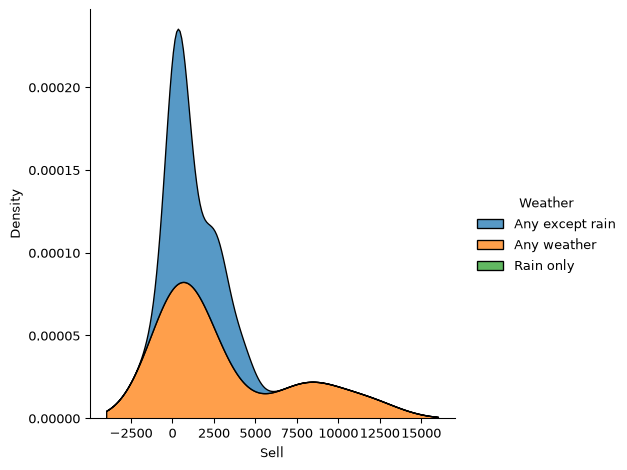
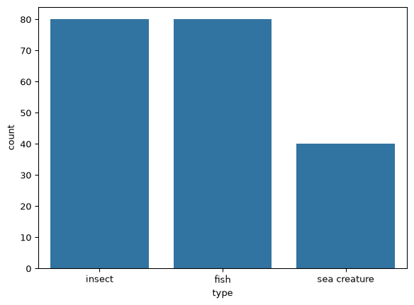
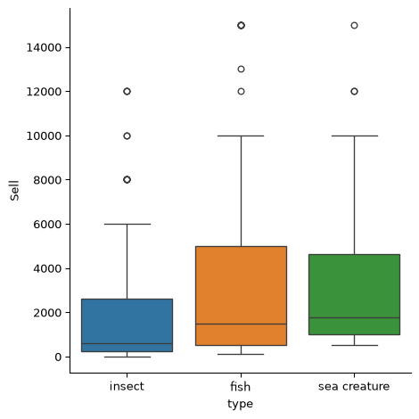
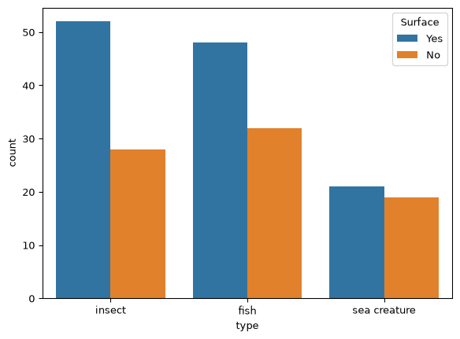
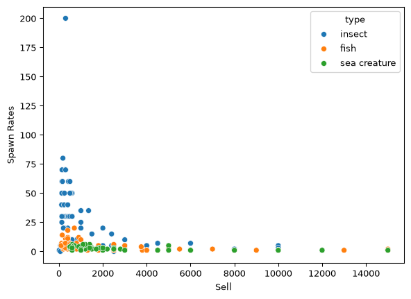

# Animal Crossing - Critterpedia Project
Parri Salak

## Background

Animal Crossing New Horizons (ACNH) is a popular video game, and one of
my personal favorites. One task that players complete during the game is
catching “critters” in order to complete their muesuem’s collection and
sell them for bells (the in-game currency). In the game, each user has a
“Critterpedia” that keeps track of everything they have caught and
donated to the muesuem. It is broken down into three categories:
Insects, Fish, and Sea Creatures.

Currently, the data for the these categories of critters is kept
seperately. In this project I want to create one complete critterpedia
dataframe. This will help see what I can catch and develop a strategy in
order to make the most money in game.

## The Data

For this project, I have three excel files containing the complete
information of all of the insects, fish, and sea creatures that can be
caught in ACNH. The orginal source of the data I will use is
Nookipedia.com, a community initiative to create a structured collection
of Animal Crossing: New Horizons data. More information can be found at:
https://nookipedia.com/wiki/Community:ACNH_Spreadsheet. I will begin by
loading each dataset.

The first dataset contains information about insects:

``` python
import pandas as pd
insects = pd.read_excel("Insects.xlsx")
insects.head()
```

<div>
<style scoped>
    .dataframe tbody tr th:only-of-type {
        vertical-align: middle;
    }
&#10;    .dataframe tbody tr th {
        vertical-align: top;
    }
&#10;    .dataframe thead th {
        text-align: right;
    }
</style>

|  | \# | Name | Icon Image | Sell | Where/How | Weather | Total Catches to Unlock | Spawn Rates | NH Jan | NH Feb | ... | Catch phrase | HHA Base Points | HHA Category | Color 1 | Color 2 | Icon Filename | Critterpedia Filename | Furniture Filename | Internal ID | Unique Entry ID |
|----|----|----|----|----|----|----|----|----|----|----|----|----|----|----|----|----|----|----|----|----|----|
| 0 | 10 | agrias butterfly | https://nh-cdn.catalogue.ac/MenuIcon/Ins6.png | 3000 | Flying near flowers | Any except rain | 20 | 5 | NaN | NaN | ... | I caught an agrias butterfly! I wonder if it f... | 64 | Pet | Pink | Green | Ins6 | InsectMiirotateha | FtrInsectMiirotateha | 620 | aj95rMzdbSbvZy9A2 |
| 1 | 69 | ant | https://nh-cdn.catalogue.ac/MenuIcon/Ins26.png | 80 | On rotten turnips or candy | Any weather | 0 | 0 | All day | All day | ... | I caught an ant! TELL ME WHERE THE QUEEN IS! | 64 | Pet | Black | White | Ins26 | InsectAri | FtrInsectAri | 588 | QZpmczZu4hW2a4Rpv |
| 2 | 14 | Atlas moth | https://nh-cdn.catalogue.ac/MenuIcon/Ins10.png | 3000 | On trees (any kind) | Any weather | 20 | 5 | NaN | NaN | ... | I caught an Atlas moth! I bet it never gets lost! | 64 | Pet | Orange | Yellow | Ins10 | InsectYonagunisan | FtrInsectYonagunisan | 652 | u2GhYQJXDCQKp7AQ8 |
| 3 | 68 | bagworm | https://nh-cdn.catalogue.ac/MenuIcon/Ins36.png | 600 | Shaking trees (hardwood or cedar only) | Any weather | 0 | 50 | All day | All day | ... | I caught a bagworm! Guess I'm a bragworm! | 64 | Pet | Brown | Blue | Ins36 | InsectMinomushi | FtrInsectMinomushi | 622 | QvxgCm82JqHsDknY4 |
| 4 | 34 | banded dragonfly | https://nh-cdn.catalogue.ac/MenuIcon/Ins24.png | 4500 | Flying near water | Any except rain | 50 | 7 | NaN | NaN | ... | I did it! Did you see that? I caught a banded ... | 64 | Pet | Black | Yellow | Ins24 | InsectOniyanma | FtrInsectOniyanma | 635 | pCFep58D6QusMSvR7 |

<p>5 rows × 45 columns</p>
</div>

``` python
insects.info()
```

    <class 'pandas.DataFrame'>
    RangeIndex: 80 entries, 0 to 79
    Data columns (total 45 columns):
     #   Column                   Non-Null Count  Dtype
    ---  ------                   --------------  -----
     0   #                        80 non-null     int64
     1   Name                     80 non-null     str  
     2   Icon Image               80 non-null     str  
     3   Sell                     80 non-null     int64
     4   Where/How                80 non-null     str  
     5   Weather                  80 non-null     str  
     6   Total Catches to Unlock  80 non-null     int64
     7   Spawn Rates              80 non-null     str  
     8   NH Jan                   20 non-null     str  
     9   NH Feb                   21 non-null     str  
     10  NH Mar                   27 non-null     str  
     11  NH Apr                   36 non-null     str  
     12  NH May                   43 non-null     str  
     13  NH Jun                   48 non-null     str  
     14  NH Jul                   61 non-null     str  
     15  NH Aug                   63 non-null     str  
     16  NH Sep                   51 non-null     str  
     17  NH Oct                   34 non-null     str  
     18  NH Nov                   27 non-null     str  
     19  NH Dec                   20 non-null     str  
     20  SH Jan                   61 non-null     str  
     21  SH Feb                   63 non-null     str  
     22  SH Mar                   51 non-null     str  
     23  SH Apr                   34 non-null     str  
     24  SH May                   27 non-null     str  
     25  SH Jun                   20 non-null     str  
     26  SH Jul                   20 non-null     str  
     27  SH Aug                   21 non-null     str  
     28  SH Sep                   27 non-null     str  
     29  SH Oct                   36 non-null     str  
     30  SH Nov                   43 non-null     str  
     31  SH Dec                   48 non-null     str  
     32  Size                     80 non-null     str  
     33  Surface                  80 non-null     str  
     34  Description              80 non-null     str  
     35  Catch phrase             80 non-null     str  
     36  HHA Base Points          80 non-null     int64
     37  HHA Category             79 non-null     str  
     38  Color 1                  80 non-null     str  
     39  Color 2                  80 non-null     str  
     40  Icon Filename            80 non-null     str  
     41  Critterpedia Filename    80 non-null     str  
     42  Furniture Filename       80 non-null     str  
     43  Internal ID              80 non-null     int64
     44  Unique Entry ID          80 non-null     str  
    dtypes: int64(5), str(40)
    memory usage: 85.8 KB

There are 80 different insects that can be caught in ACNH.

The next dataset contains information about fish:

``` python
fish = pd.read_excel("Fish.xlsx")
fish.head()
```

<div>
<style scoped>
    .dataframe tbody tr th:only-of-type {
        vertical-align: middle;
    }
&#10;    .dataframe tbody tr th {
        vertical-align: top;
    }
&#10;    .dataframe thead th {
        text-align: right;
    }
</style>

|  | \# | Name | Icon Image | Sell | Where/How | Shadow | Catch Difficulty | Vision | Total Catches to Unlock | Spawn Rates | ... | HHA Base Points | HHA Category | Color 1 | Color 2 | Lighting Type | Icon Filename | Critterpedia Filename | Furniture Filename | Internal ID | Unique Entry ID |
|----|----|----|----|----|----|----|----|----|----|----|----|----|----|----|----|----|----|----|----|----|----|
| 0 | 56 | anchovy | "https://nh-cdn.catalogue.ac/MenuIcon/Fish81.png | 200 | Sea | Small | Very Easy | Very Wide | 0 | 2–5 | ... | 71 | Pet | Blue | Red | No lighting | Fish81 | FishAntyobi | FtrFishAntyobi | 4201 | LzuWkSQP55uEpRCP5 |
| 1 | 36 | angelfish | "https://nh-cdn.catalogue.ac/MenuIcon/Fish81.png | 3000 | River | Small | Easy | Medium | 20 | 2–5 | ... | 71 | Pet | Yellow | Black | Fluorescent | Fish30 | FishAngelfish | FtrFishAngelfish | 2247 | XTCFCk2SiuY5YXLZ7 |
| 2 | 44 | arapaima | https://nh-cdn.catalogue.ac/MenuIcon/Fish36.png | 10000 | River | XX-Large | Very Hard | Narrow | 50 | 1 | ... | 71 | Pet | Black | Blue | No lighting | Fish36 | FishPiraruku | FtrFishPiraruku | 2253 | mZy4BES54bqwi97br |
| 3 | 41 | arowana | https://nh-cdn.catalogue.ac/MenuIcon/Fish33.png | 10000 | River | Large | Very Hard | Medium | 50 | 1–2 | ... | 71 | Pet | Yellow | Black | Fluorescent | Fish33 | FishArowana | FtrFishArowana | 2250 | F68AvCaqddBJL7ZSN |
| 4 | 58 | barred knifejaw | https://nh-cdn.catalogue.ac/MenuIcon/Fish47.png | 5000 | Sea | Medium | Hard | Medium | 20 | 3–5 | ... | 71 | Pet | White | Black | Fluorescent | Fish47 | FishIshidai | FtrFishIshidai | 2265 | X3R9SFSAaDzBF4fE3 |

<p>5 rows × 48 columns</p>
</div>

``` python
fish.info()
```

    <class 'pandas.DataFrame'>
    RangeIndex: 80 entries, 0 to 79
    Data columns (total 48 columns):
     #   Column                   Non-Null Count  Dtype
    ---  ------                   --------------  -----
     0   #                        80 non-null     int64
     1   Name                     80 non-null     str  
     2   Icon Image               80 non-null     str  
     3   Sell                     80 non-null     int64
     4   Where/How                80 non-null     str  
     5   Shadow                   80 non-null     str  
     6   Catch Difficulty         80 non-null     str  
     7   Vision                   80 non-null     str  
     8   Total Catches to Unlock  80 non-null     int64
     9   Spawn Rates              80 non-null     str  
     10  NH Jan                   31 non-null     str  
     11  NH Feb                   31 non-null     str  
     12  NH Mar                   35 non-null     str  
     13  NH Apr                   39 non-null     str  
     14  NH May                   44 non-null     str  
     15  NH Jun                   55 non-null     str  
     16  NH Jul                   58 non-null     str  
     17  NH Aug                   60 non-null     str  
     18  NH Sep                   63 non-null     str  
     19  NH Oct                   42 non-null     str  
     20  NH Nov                   37 non-null     str  
     21  NH Dec                   32 non-null     str  
     22  SH Jan                   58 non-null     str  
     23  SH Feb                   60 non-null     str  
     24  SH Mar                   63 non-null     str  
     25  SH Apr                   42 non-null     str  
     26  SH May                   37 non-null     str  
     27  SH Jun                   32 non-null     str  
     28  SH Jul                   31 non-null     str  
     29  SH Aug                   31 non-null     str  
     30  SH Sep                   35 non-null     str  
     31  SH Oct                   39 non-null     str  
     32  SH Nov                   44 non-null     str  
     33  SH Dec                   55 non-null     str  
     34  Size                     80 non-null     str  
     35  Surface                  80 non-null     str  
     36  Description              80 non-null     str  
     37  Catch phrase             80 non-null     str  
     38  HHA Base Points          80 non-null     int64
     39  HHA Category             80 non-null     str  
     40  Color 1                  80 non-null     str  
     41  Color 2                  80 non-null     str  
     42  Lighting Type            80 non-null     str  
     43  Icon Filename            80 non-null     str  
     44  Critterpedia Filename    80 non-null     str  
     45  Furniture Filename       80 non-null     str  
     46  Internal ID              80 non-null     int64
     47  Unique Entry ID          80 non-null     str  
    dtypes: int64(5), str(43)
    memory usage: 85.5 KB

There are also 80 different fish that can be caught.

The last dataset contains information about sea creatures:

``` python
sea_creatures = pd.read_excel("Sea_Creatures.xlsx")
sea_creatures .head()
```

<div>
<style scoped>
    .dataframe tbody tr th:only-of-type {
        vertical-align: middle;
    }
&#10;    .dataframe tbody tr th {
        vertical-align: top;
    }
&#10;    .dataframe thead th {
        text-align: right;
    }
</style>

|  | \# | Name | Icon Image | Sell | Shadow | Movement Speed | Total Catches to Unlock | Spawn Rates | NH Jan | NH Feb | ... | Color 1 | Color 2 | Lighting Type | Icon Filename | Critterpedia Filename | Furniture Filename | Version Added | Unlocked? | Internal ID | Unique Entry ID |
|----|----|----|----|----|----|----|----|----|----|----|----|----|----|----|----|----|----|----|----|----|----|
| 0 | 17 | abalone | https://nh-cdn.catalogue.ac/MenuIcon/Awabi.png | 2000 | Medium | Medium | 20 | 1–6 | 4 PM – 9 AM | NaN | ... | NaN | NaN | Fluorescent | Awabi | DiveFishAwabi | FtrDiveFishAwabi | 1.3.0 | Yes | 2835 | LnurTYKDSPtsiQr62 |
| 1 | 28 | acorn barnacle | https://nh-cdn.catalogue.ac/MenuIcon/Fujitsubo... | 600 | X-Small | Stationary | 0 | 6–11 | All day | All day | ... | NaN | NaN | Fluorescent | Fujitsubo | DiveFishFujitsubo | FtrDiveFishFujitsubo | 1.3.0 | Yes | 2832 | QjvNJrjo5pNqZzuGq |
| 2 | 19 | chambered nautilus | https://nh-cdn.catalogue.ac/MenuIcon/Oumugai.png | 1800 | Medium | Medium | 20 | 3–5 | NaN | NaN | ... | NaN | NaN | Fluorescent | Oumugai | DiveFishOumugai | FtrDiveFishOumugai | 1.3.0 | Yes | 2856 | cmNawSTGaZZjRi5sp |
| 3 | 25 | Dungeness crab | https://nh-cdn.catalogue.ac/MenuIcon/Dungeness... | 1900 | Medium | Medium | 20 | 3–5 | All day | All day | ... | NaN | NaN | Fluorescent | DungenessCrab | DiveFishDungenessCrab | FtrDiveFishDungenessCrab | 1.3.0 | Yes | 7308 | jTP553H6DNuKBSAKa |
| 4 | 23 | firefly squid | https://nh-cdn.catalogue.ac/MenuIcon/Hotaruika... | 1400 | X-Small | Slow | 0 | 6 | NaN | NaN | ... | NaN | NaN | Fluorescent | Hotaruika | DiveFishHotaruika | FtrDiveFishHotaruika | 1.3.0 | Yes | 6920 | ETuWxdyZNpqeFCYby |

<p>5 rows × 48 columns</p>
</div>

``` python
sea_creatures.info()
```

    <class 'pandas.DataFrame'>
    RangeIndex: 40 entries, 0 to 39
    Data columns (total 48 columns):
     #   Column                   Non-Null Count  Dtype  
    ---  ------                   --------------  -----  
     0   #                        40 non-null     int64  
     1   Name                     40 non-null     str    
     2   Icon Image               40 non-null     str    
     3   Sell                     40 non-null     int64  
     4   Shadow                   40 non-null     str    
     5   Movement Speed           40 non-null     str    
     6   Total Catches to Unlock  40 non-null     int64  
     7   Spawn Rates              40 non-null     str    
     8   NH Jan                   20 non-null     str    
     9   NH Feb                   18 non-null     str    
     10  NH Mar                   19 non-null     str    
     11  NH Apr                   20 non-null     str    
     12  NH May                   22 non-null     str    
     13  NH Jun                   24 non-null     str    
     14  NH Jul                   24 non-null     str    
     15  NH Aug                   24 non-null     str    
     16  NH Sep                   27 non-null     str    
     17  NH Oct                   22 non-null     str    
     18  NH Nov                   25 non-null     str    
     19  NH Dec                   23 non-null     str    
     20  SH Jan                   24 non-null     str    
     21  SH Feb                   24 non-null     str    
     22  SH Mar                   27 non-null     str    
     23  SH Apr                   22 non-null     str    
     24  SH May                   25 non-null     str    
     25  SH Jun                   23 non-null     str    
     26  SH Jul                   20 non-null     str    
     27  SH Aug                   18 non-null     str    
     28  SH Sep                   19 non-null     str    
     29  SH Oct                   20 non-null     str    
     30  SH Nov                   22 non-null     str    
     31  SH Dec                   24 non-null     str    
     32  Size                     40 non-null     str    
     33  Surface                  40 non-null     str    
     34  Description              40 non-null     str    
     35  Catch phrase             40 non-null     str    
     36  HHA Base Points          40 non-null     int64  
     37  HHA Category             40 non-null     str    
     38  Color 1                  0 non-null      float64
     39  Color 2                  0 non-null      float64
     40  Lighting Type            40 non-null     str    
     41  Icon Filename            40 non-null     str    
     42  Critterpedia Filename    40 non-null     str    
     43  Furniture Filename       40 non-null     str    
     44  Version Added            40 non-null     str    
     45  Unlocked?                40 non-null     str    
     46  Internal ID              40 non-null     int64  
     47  Unique Entry ID          40 non-null     str    
    dtypes: float64(2), int64(5), str(41)
    memory usage: 47.3 KB

There are only 40 sea creatures to be caught in ACNH.

## Data Visualization

Before working on combining this data to make a complete critterpedia
dataframe, I want to explore and visualize each type of critter on its
own. One of the variables that I am very interested in is “Sell”. This
is in each critter dataset, and it describes how much you can sell your
caught critters for at the general store in game.

``` python
import seaborn as sns
import matplotlib.pyplot as plt
```

For the insects, I am going to make a scatteplot showing the
relationship between sell price and the weather the are aviable to be
caught in.

``` python
#Boxplot showing Sell price broken down by Weather for Insects
sns.catplot(data=insects, x='Weather', y='Sell', kind='box')
plt.show()
```


``` python
#Stacked histogram for the distribution of Sell by weather
sns.displot(data=insects, x='Sell', hue='Weather', kind='kde', multiple="stack")
plt.show()
```

    C:\Users\Parri Salak\AppData\Local\Temp\ipykernel_20184\1439334690.py:2: UserWarning: Dataset has 0 variance; skipping density estimate. Pass `warn_singular=False` to disable this warning.
      sns.displot(data=insects, x='Sell', hue='Weather', kind='kde', multiple="stack")



It seems like the best time to catch insects is when it is not raining.
Insecta caught during rainy weather seem to have a consistent lower sell
price, whereas those caught in any weather are spread towards mor
extreme values.

``` python
#Finding the max sell price and which insects have that value
max_sell = insects['Sell'].max()
max_sell_insesect = insects[insects['Sell'] == max_sell]
max_sell_insesect
```

<div>
<style scoped>
    .dataframe tbody tr th:only-of-type {
        vertical-align: middle;
    }
&#10;    .dataframe tbody tr th {
        vertical-align: top;
    }
&#10;    .dataframe thead th {
        text-align: right;
    }
</style>

|  | \# | Name | Icon Image | Sell | Where/How | Weather | Total Catches to Unlock | Spawn Rates | NH Jan | NH Feb | ... | Catch phrase | HHA Base Points | HHA Category | Color 1 | Color 2 | Icon Filename | Critterpedia Filename | Furniture Filename | Internal ID | Unique Entry ID |
|----|----|----|----|----|----|----|----|----|----|----|----|----|----|----|----|----|----|----|----|----|----|
| 29 | 61 | giraffe stag | https://nh-cdn.catalogue.ac/MenuIcon/Ins77.png | 12000 | On palm trees | Any weather | 100 | 1 | NaN | NaN | ... | I caught a giraffe stag! Does that make it a l... | 64 | Pet | Black | Black | Ins77 | InsectGirafanokogirikuwagata | FtrInsectGirafanokogirikuwagata | 3482 | PSChjzMhGwhnsHTs4 |
| 30 | 60 | golden stag | https://nh-cdn.catalogue.ac/MenuIcon/Ins50.png | 12000 | On palm trees | Any weather | 100 | 1 | NaN | NaN | ... | Wooooow! I caught a golden stag! Does this mea... | 64 | Pet | Black | Yellow | Ins50 | InsectOugononikuwagata | FtrInsectOugononikuwagata | 638 | 2C8cSphidFCBPxYEe |
| 39 | 65 | horned hercules | https://nh-cdn.catalogue.ac/MenuIcon/Ins54.png | 12000 | On palm trees | Any weather | 100 | 1 | NaN | NaN | ... | I caught a horned hercules! Guess I was stronger! | 64 | Pet | Yellow | Black | Ins54 | InsectHerakuresuohkabuto | FtrInsectHerakuresuohkabuto | 600 | TqhEomNEMDZ2wcTpk |

<p>3 rows × 45 columns</p>
</div>

The higgest sell price for insects is 12,000 bells. The three insects
with this sell price are the giraffe stag, golden stag, and horned
hercules.

Next, I’ll look at the catch difficulty of fish and their sell prices.

``` python
#I want to specifiy the order of the categories
custom_order = ['Very Easy', 'Easy', 'Medium', 'Hard', 'Very Hard']

#Boxplot showing Sell price broken down by Catch Difficulty for Fish
sns.catplot(data=fish, x='Catch Difficulty', y='Sell', kind='box', order=custom_order)
plt.show()
```


As expected, the sell price appears to increase as the fish become more
difficult to catch.

``` python
#Finding the max sell price and which fish have that value
max_sell = fish['Sell'].max()
max_sell_fish = fish[fish['Sell'] == max_sell]
max_sell_fish
```

<div>
<style scoped>
    .dataframe tbody tr th:only-of-type {
        vertical-align: middle;
    }
&#10;    .dataframe tbody tr th {
        vertical-align: top;
    }
&#10;    .dataframe thead th {
        text-align: right;
    }
</style>

|  | \# | Name | Icon Image | Sell | Where/How | Shadow | Catch Difficulty | Vision | Total Catches to Unlock | Spawn Rates | ... | HHA Base Points | HHA Category | Color 1 | Color 2 | Lighting Type | Icon Filename | Critterpedia Filename | Furniture Filename | Internal ID | Unique Entry ID |
|----|----|----|----|----|----|----|----|----|----|----|----|----|----|----|----|----|----|----|----|----|----|
| 5 | 79 | barreleye | https://nh-cdn.catalogue.ac/MenuIcon/Fish84.png | 15000 | Sea | Small | Very Hard | Very Narrow | 100 | 1 | ... | 71 | Pet | Black | Black | Fluorescent | Fish84 | FishDemenigisu | FtrFishDemenigisu | 4204 | BpqTa4zmTjv3Nm4wE |
| 18 | 80 | coelacanth | https://nh-cdn.catalogue.ac/MenuIcon/Fish63.png | 15000 | Sea (rainy days) | XX-Large | Very Hard | Very Narrow | 100 | 1–2 | ... | 71 | Pet | Black | Black | Fluorescent | Fish63 | FishSirakansu | FtrFishSirakansu | 2284 | NjMZQ6Xi9NswEXnHH |
| 23 | 42 | dorado | https://nh-cdn.catalogue.ac/MenuIcon/Fish34.png | 15000 | River | X-Large | Very Hard | Narrow | 100 | 1–2 | ... | 71 | Pet | Yellow | Black | Fluorescent | Fish34 | FishDolado | FtrFishDolado | 2251 | G7ZwD67cRMHBwTSKH |
| 30 | 29 | golden trout | https://nh-cdn.catalogue.ac/MenuIcon/Fish79.png | 15000 | River (clifftop) | Medium | Very Hard | Very Narrow | 100 | 1 | ... | 71 | Pet | Brown | Black | Fluorescent | Fish79 | FishGoldenTorauto | FtrFishGoldenTorauto | 4193 | wwGzR7FzWNJ7cDz9X |
| 32 | 74 | great white shark | https://nh-cdn.catalogue.ac/MenuIcon/Fish62.png | 15000 | Sea | X-Large w/Fin | Very Hard | Narrow | 50 | 2 | ... | 71 | Pet | Blue | Blue | No lighting | Fish62 | FishSame | FtrFishSame | 2280 | EPypAeJGuTDGFJRnx |
| 69 | 30 | stringfish | https://nh-cdn.catalogue.ac/MenuIcon/Fish26.png | 15000 | River (clifftop) | X-Large | Very Hard | Very Narrow | 100 | 1 | ... | 71 | Pet | Brown | Black | Fluorescent | Fish26 | FishItou | FtrFishItou | 2241 | APXg8kSzjcmoGGWSP |

<p>6 rows × 48 columns</p>
</div>

The highest sell price for fish is 15,000 bells. There are six different
fish that can be caught and sold at this price.

Finally, I will look at the sell price for sea creatures based on their
movement speed.

``` python
#I want to specifiy the order of the categories
custom_order = ['Stationary', 'Very slow', 'Slow', 'Medium', 'Fast', 'Very fast']

#Boxplot showing Sell price broken down by Movement Speed for Sea Creatures
sns.catplot(data=sea_creatures, x='Sell', y='Movement Speed', kind='box', order=custom_order)
plt.show()
```



Faster sea creatures, which are more difficult to catch, also seem to
have a higher sell price.

``` python
#Finding the max sell price and which sea creatures have that value
max_sell = sea_creatures['Sell'].max()
max_sell_sea_creature = sea_creatures[sea_creatures['Sell'] == max_sell]
max_sell_sea_creature
```

<div>
<style scoped>
    .dataframe tbody tr th:only-of-type {
        vertical-align: middle;
    }
&#10;    .dataframe tbody tr th {
        vertical-align: top;
    }
&#10;    .dataframe thead th {
        text-align: right;
    }
</style>

|  | \# | Name | Icon Image | Sell | Shadow | Movement Speed | Total Catches to Unlock | Spawn Rates | NH Jan | NH Feb | ... | Color 1 | Color 2 | Lighting Type | Icon Filename | Critterpedia Filename | Furniture Filename | Version Added | Unlocked? | Internal ID | Unique Entry ID |
|----|----|----|----|----|----|----|----|----|----|----|----|----|----|----|----|----|----|----|----|----|----|
| 8 | 18 | gigas giant clam | https://nh-cdn.catalogue.ac/MenuIcon/Shakogai.png | 15000 | X-Large | Very fast | 80 | 1 | NaN | NaN | ... | NaN | NaN | Fluorescent | Shakogai | DiveFishShakogai | FtrDiveFishShakogai | 1.3.0 | Yes | 7214 | EQmRaHjokMEGTDC7G |

<p>1 rows × 48 columns</p>
</div>

Gigas giant clams are the sea creature with the higgest sell price at
15,000 bells. This is the same price as the higgest sell price for fish,
but there were many more fish species at that price.

## Combining the Data

I want to combine the data for insects, fish, and sea creatures into one
complete critterpedia dataset. Before doing so, I want to add a new
variable to each that will describe the critter type - insect, fish, or
sea creature.

``` python
#assigning the critter type for each dataset on its own before combining
insects['type'] = 'insect'
fish['type'] = 'fish'
sea_creatures['type'] = 'sea creature'
```

I decided to use concat since each dataset has unique observations, or
“critters”, that will not have matches in the other data. However, each
dataset contains almost identical columns/variables. I am specifying an
outer join because I want every column from every dataset.

``` python
#Concat Insects, Fish, and Sea Creatures
critterpedia = pd.concat([insects, fish, sea_creatures], ignore_index=True, join='outer')
```

``` python
#Checking that all columns are included in my critterpedia
critterpedia.columns
```

    Index(['#', 'Name', 'Icon Image', 'Sell', 'Where/How', 'Weather',
           'Total Catches to Unlock', 'Spawn Rates', 'NH Jan', 'NH Feb', 'NH Mar',
           'NH Apr', 'NH May', 'NH Jun', 'NH Jul', 'NH Aug', 'NH Sep', 'NH Oct',
           'NH Nov', 'NH Dec', 'SH Jan', 'SH Feb', 'SH Mar', 'SH Apr', 'SH May',
           'SH Jun', 'SH Jul', 'SH Aug', 'SH Sep', 'SH Oct', 'SH Nov', 'SH Dec',
           'Size', 'Surface', 'Description', 'Catch phrase', 'HHA Base Points',
           'HHA Category', 'Color 1', 'Color 2', 'Icon Filename',
           'Critterpedia Filename', 'Furniture Filename', 'Internal ID',
           'Unique Entry ID', 'type', 'Shadow', 'Catch Difficulty', 'Vision',
           'Lighting Type', 'Movement Speed', 'Version Added', 'Unlocked?'],
          dtype='str')

``` python
#Counting the number of critters of each type to make sure I am not missing any
sns.countplot(data=critterpedia, x='type')
plt.show()
```


How does Sell price differ across types of critters?

``` python
#Boxplot showing Sell price broken down by type of critter
sns.catplot(data=critterpedia, x='type', y='Sell', kind='box', hue='type')
plt.show()
```



Just based on sell price for each type of critter, it seems like the
best strategy for making money would be to focus on catching sea
creatures.

## Data Cleaning & Handling Missing Data

To begin, there are several columns containing ID type variables. For
the purpose of my project, I think it is only neccessary to keep one.

``` python
#Making sure there is a unique value for all 200 critters
critterpedia['Name'].nunique()
```

    200

Since “Name” is able to uniquely identify every critter I will use it as
my ID variable.

``` python
#Dropping extra identification columns
critterpedia = critterpedia.drop(columns=['#','Icon Filename','Critterpedia Filename','Furniture Filename','Unique Entry ID','Internal ID'])
```

I also want to get rid of the variables related to Happy Home Academy
(HHA) because it is not relevant in the catching and selling of
critters. It is essentially an HOA in animal crossing that evaluates
your home decor choices. Since caught critters can be displayed, the HHA
has data related to them. However, I do not care what they think of me
and my lifestyle choices!! Since this project is for my own personal
benefit, I will be excluding their data.

``` python
#Filter to get rid of HHA variables and those related to it
critterpedia = critterpedia.drop(columns=critterpedia.filter(regex=r"HHA ").columns)
critterpedia = critterpedia.drop(columns=['Color 1','Color 2','Lighting Type','Version Added', 'Unlocked?'])
```

Additonally, this dataset contains information about what times the
critters can be caught for both the northern and southern hemisphere.
This is important because the seasons in animal crossing reflect what is
haapening in your real-world location. Since I am in the Northern
Hemisphere, I only want to keep the data relevant to me. I will delete
each of the catch time columns that start with “SH”.

``` python
#Getting rid of southern hemisphere data
critterpedia = critterpedia.drop(columns=critterpedia.filter(regex=r"SH ").columns)

#No longer need NH to specify location, just want month
critterpedia.columns = critterpedia.columns.str.replace(r"NH ", "", regex=True)

critterpedia.columns
```

    Index(['Name', 'Icon Image', 'Sell', 'Where/How', 'Weather',
           'Total Catches to Unlock', 'Spawn Rates', 'Jan', 'Feb', 'Mar', 'Apr',
           'May', 'Jun', 'Jul', 'Aug', 'Sep', 'Oct', 'Nov', 'Dec', 'Size',
           'Surface', 'Description', 'Catch phrase', 'type', 'Shadow',
           'Catch Difficulty', 'Vision', 'Movement Speed'],
          dtype='str')

The variable “Spawn Rates” respresents the percent chance of that
critter being present on your island/avaiable to catch in your game at
any given time. However, it is a string datatype right now because some
of the values are listed as a range like “5-10”. I want to fix this and
take the lower number to be more conservative.

``` python
#Split the string, take the first value, then make it an integer
critterpedia['Spawn Rates'] = critterpedia['Spawn Rates'].str.split("–").str[0].astype('int')
```

Since columns did not match up perfectly between my datasets, I want to
find and deal with missing values in my critterpedia. My goal is to make
this as complete of a dataset as possible, so I want to minimize the
amount of information that is missing.

``` python
#Count of missing values
critterpedia.isnull().sum()
```

    Name                         0
    Icon Image                   0
    Sell                         0
    Where/How                   40
    Weather                    120
    Total Catches to Unlock      0
    Spawn Rates                  0
    Jan                        129
    Feb                        130
    Mar                        119
    Apr                        105
    May                         91
    Jun                         73
    Jul                         57
    Aug                         53
    Sep                         59
    Oct                        102
    Nov                        111
    Dec                        125
    Size                         0
    Surface                      0
    Description                  0
    Catch phrase                 0
    type                         0
    Shadow                      80
    Catch Difficulty           120
    Vision                     120
    Movement Speed             160
    dtype: int64

Based on the counts of missing values, I know that only sea creaturtes
are missing data for the “Where/How” varibale. Because of this, I can
fill in all missing values for it with the “Sea”.

``` python
#Replace missing values for where/how with 'sea'
critterpedia['Where/How'] = critterpedia['Where/How'].fillna('Sea')
critterpedia['Where/How'].isnull().sum()
```

    np.int64(0)

I also know that missing values in the month columns are a result of the
citter not being aviable to catch at all during it. Rather than leave
missing values, I will replace them with “Not avaiable”. I think this
makes sense in contrast with those that are marked as “All Day”.

``` python
#Replace missing values for month to month catch availability with 'Not Available'
critterpedia[['Jan', 'Feb', 'Mar', 'Apr', 'May', 'Jun', 'Jul', 'Aug', 'Sep', 'Oct', 'Nov', 'Dec']] = critterpedia[['Jan', 'Feb', 'Mar', 'Apr', 'May', 'Jun', 'Jul', 'Aug', 'Sep', 'Oct', 'Nov', 'Dec']].fillna('Not Available')

critterpedia[['Jan', 'Feb', 'Mar', 'Apr', 'May', 'Jun', 'Jul', 'Aug', 'Sep', 'Oct', 'Nov', 'Dec']].isnull().sum()
```

    Jan    0
    Feb    0
    Mar    0
    Apr    0
    May    0
    Jun    0
    Jul    0
    Aug    0
    Sep    0
    Oct    0
    Nov    0
    Dec    0
    dtype: int64

## Critter Catching Strategy

Finally, I want to compare how the different critter types compare
across variables and use the information to make a strategy for catching
and selling critters in ACNH. I am interested in some summary statistics
so I will group by data by critter type. I want the mean and standard
deviation of Sell, Spawn Rates, and Total Catches to Unlock for each
group.

The “Total Catches to Unlock” refers to the total critter of that type
you must catch in your lifetime before a particular species can start
spawning on your island.

``` python
#Grouping the data based on critter type and then getting summary statistics
grouped_data = critterpedia.groupby('type',as_index=False).agg(
    sell_mean=('Sell','mean'),
    sell_std=('Sell','std'),
    spawn_mean=('Spawn Rates','mean'),
    spawn_std=('Spawn Rates','std'),
    catch_to_unlock_mean=('Total Catches to Unlock','mean'),
    catch_to_unlock_std=('Total Catches to Unlock','std')
)

grouped_data
```

<div>
<style scoped>
    .dataframe tbody tr th:only-of-type {
        vertical-align: middle;
    }
&#10;    .dataframe tbody tr th {
        vertical-align: top;
    }
&#10;    .dataframe thead th {
        text-align: right;
    }
</style>

|  | type | sell_mean | sell_std | spawn_mean | spawn_std | catch_to_unlock_mean | catch_to_unlock_std |
|----|----|----|----|----|----|----|----|
| 0 | fish | 3745.0 | 4517.151561 | 3.8625 | 3.893337 | 19.250 | 27.364164 |
| 1 | insect | 2220.5 | 3209.388877 | 26.3375 | 29.915469 | 17.500 | 30.084270 |
| 2 | sea creature | 3345.0 | 3730.742004 | 2.6750 | 1.685344 | 21.625 | 28.338329 |

</div>

Another variable I am intereste in is surface. It is a yes or no value
describing how easy it is to find the critter. Those that are ‘yes’
appear in the wild, while the ’no’s are not part of normal surface
wildlife and may require more effort to locate.

``` python
#Countplot showing how many surface y/n are each critter type
sns.countplot(data=critterpedia, x='type', hue='Surface')
plt.show()
```



Based on this is, it seems like I am most likely to encounter insects in
the wild, and sea creatures might take the most effort to locate.

Now I want to look at which critters that spawn most frequently will
sell for the higgest price.

``` python
#Showing critters with the higgest spawn rates that sell for the most bells
target_critters = critterpedia[['Name', 'type', 'Spawn Rates', 'Sell']].sort_values(by=['Spawn Rates', 'Sell'], ascending=False).head(10)
target_critters
```

<div>
<style scoped>
    .dataframe tbody tr th:only-of-type {
        vertical-align: middle;
    }
&#10;    .dataframe tbody tr th {
        vertical-align: top;
    }
&#10;    .dataframe thead th {
        text-align: right;
    }
</style>

|     | Name              | type   | Spawn Rates | Sell |
|-----|-------------------|--------|-------------|------|
| 23  | firefly           | insect | 200         | 300  |
| 60  | red dragonfly     | insect | 80          | 180  |
| 11  | common bluebottle | insect | 70          | 300  |
| 62  | robust cicada     | insect | 70          | 300  |
| 7   | brown cicada      | insect | 70          | 250  |
| 49  | monarch butterfly | insect | 70          | 140  |
| 15  | damselfly         | insect | 60          | 500  |
| 5   | bell cricket      | insect | 60          | 430  |
| 12  | common butterfly  | insect | 60          | 160  |
| 32  | grasshopper       | insect | 60          | 160  |

</div>

The results in a top ten target critters that are insects. However, none
of the sell prices are over 500. This is quite small considering that
the higgest sell price for insects is 12,000. I want to see what the
target critters would be if I decided to prioritze sell before spawn
rates.

``` python
#Showing critters with the higgest sell price the spawn the most
target_critters = critterpedia[['Name', 'type', 'Sell', 'Spawn Rates']].sort_values(by=['Sell', 'Spawn Rates'], ascending=False).head(10)
target_critters
```

<div>
<style scoped>
    .dataframe tbody tr th:only-of-type {
        vertical-align: middle;
    }
&#10;    .dataframe tbody tr th {
        vertical-align: top;
    }
&#10;    .dataframe thead th {
        text-align: right;
    }
</style>

|     | Name              | type         | Sell  | Spawn Rates |
|-----|-------------------|--------------|-------|-------------|
| 112 | great white shark | fish         | 15000 | 2           |
| 85  | barreleye         | fish         | 15000 | 1           |
| 98  | coelacanth        | fish         | 15000 | 1           |
| 103 | dorado            | fish         | 15000 | 1           |
| 110 | golden trout      | fish         | 15000 | 1           |
| 149 | stringfish        | fish         | 15000 | 1           |
| 168 | gigas giant clam  | sea creature | 15000 | 1           |
| 157 | whale shark       | fish         | 13000 | 1           |
| 29  | giraffe stag      | insect       | 12000 | 1           |
| 30  | golden stag       | insect       | 12000 | 1           |

</div>

Although this gives me the critters that can be sold for the most bells,
they all have extremely low spawn rates that would make it difficult to
specifically aim to catch them.

I suspect that as sell price increases, spawn rates descrease. This
would be why I am having a more difficult time identifying critters with
high values for each. I’ll use a scatterplot to investigate this.

``` python
#Scatterplot showing the relationship between sell price and spawn rates
#Colored by critter type
sns.scatterplot(data=critterpedia, x='Sell', y='Spawn Rates', hue='type')
plt.show()
```



Because of this, I am going to filter the data to only those critters
with a high enough spawn rate and sell price. I will do that by only
looking at critters that are above the average spawn rate since I can
expect to encounter them on my island more frequently. Then I will sort
these critters by their sell price.

``` python
#Identifying target critters for catching based on sell and then spawn rates (after filtering to average or above spawn)
target_critters = critterpedia[['Name', 'type', 'Sell', 'Spawn Rates']]
target_critters = target_critters[target_critters['Spawn Rates'] >= critterpedia['Spawn Rates'].mean()]

target_critters = target_critters.sort_values(by=['Sell', 'Spawn Rates'], ascending=False).head(10)
target_critters
```

<div>
<style scoped>
    .dataframe tbody tr th:only-of-type {
        vertical-align: middle;
    }
&#10;    .dataframe tbody tr th {
        vertical-align: top;
    }
&#10;    .dataframe thead th {
        text-align: right;
    }
</style>

|     | Name                 | type   | Sell | Spawn Rates |
|-----|----------------------|--------|------|-------------|
| 52  | orchid mantis        | insect | 2400 | 15          |
| 64  | saw stag             | insect | 2000 | 20          |
| 71  | tiger beetle         | insect | 1500 | 15          |
| 37  | horned dynastid      | insect | 1350 | 35          |
| 47  | miyama stag          | insect | 1000 | 35          |
| 34  | hermit crab          | insect | 1000 | 25          |
| 44  | man-faced stink bug  | insect | 1000 | 20          |
| 53  | paper kite butterfly | insect | 1000 | 20          |
| 141 | salmon               | fish   | 700  | 20          |
| 3   | bagworm              | insect | 600  | 50          |

</div>

Although insects appeared to have the lowest sell prices of any critter
type, they are the group with the highest spawn rates. Because of this,
my strategy will be to focus on catching the insects I have identified
as target critters.

## Next Steps

Although this is a good start to building my critter catching strategy
from a complete critterpedia dataset, there is still work to be done.
For the sake of this project, I do not have time to finish everything I
wished to accomplish, but I plan to continue updating my work.

I would like to convert the month to month aviablities into the amount
of hours each critter is available to be caught. All day would be come
24 and not available would be 0. However, what is more challenging is
converting the rest of the unique values. For strings such as “4 PM – 9
AM” I would need to isolate the start and end times, and use them to
find the time difference in hours. Then, I could further my analysis
based on how much opportunity there is to catch the critters as well.

Additionally, there are a few more variables that I did not have the
time to fill in the missing values for. The variable I would focus on is
“Catch Difficulty”. Although fish is the only critter type currently
using this ranking systme, I want to analyze values from other columns
for insects and sea creatures to assign them categories for catch
difficulty as well. For example, using the movement speed of sea
creatures to determine their catch difficulty. One idea I had for
insects is to search their “where/How” for key words such as “Flying”
that would indicate a critter is moving rather than stationary. Then I
could use this to assign them to difficulty levels.
