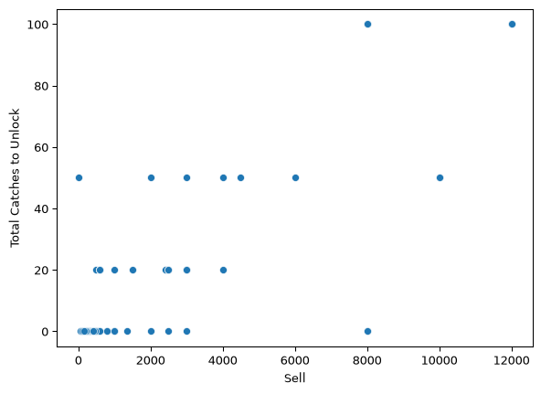
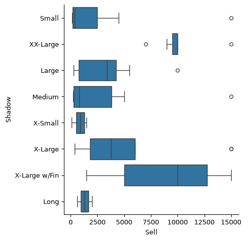

# Animal Crossing - Critterpedia Project


## Background

Animal Crossing New Horizons (ACNH) is a popular video game, and one of
my personal favorites. One task that players complete during the game is
catching “critters” in order to complete their muesuem’s collection and
sell them for money. In the game, each user has a “Critterpedia” that
keeps track of everything they have caught and donated to the muesuem.
It is broken down into three categories: Insects, Fish, and Sea
Creatures.

## The Data

For this project, I have three excel files containing the complete
information of all of the insects, fish, and sea creatures that can be
caught in ACNH. The orginal source of the data I will use is
Nookipedia.com, a community initiative to create a structured collection
of Animal Crossing: New Horizons data. More information can be found at:
https://nookipedia.com/wiki/Community:ACNH_Spreadsheet. I will begin by
loading each dataset.

The first dataset contains information about insects:

``` python
import pandas as pd
insects = pd.read_excel("Insects.xlsx")
insects.head()
```

<div>
<style scoped>
    .dataframe tbody tr th:only-of-type {
        vertical-align: middle;
    }
&#10;    .dataframe tbody tr th {
        vertical-align: top;
    }
&#10;    .dataframe thead th {
        text-align: right;
    }
</style>

|  | \# | Name | Icon Image | Sell | Where/How | Weather | Total Catches to Unlock | Spawn Rates | NH Jan | NH Feb | ... | Catch phrase | HHA Base Points | HHA Category | Color 1 | Color 2 | Icon Filename | Critterpedia Filename | Furniture Filename | Internal ID | Unique Entry ID |
|----|----|----|----|----|----|----|----|----|----|----|----|----|----|----|----|----|----|----|----|----|----|
| 0 | 10 | agrias butterfly | https://nh-cdn.catalogue.ac/MenuIcon/Ins6.png | 3000 | Flying near flowers | Any except rain | 20 | 5 | NaN | NaN | ... | I caught an agrias butterfly! I wonder if it f... | 64 | Pet | Pink | Green | Ins6 | InsectMiirotateha | FtrInsectMiirotateha | 620 | aj95rMzdbSbvZy9A2 |
| 1 | 69 | ant | https://nh-cdn.catalogue.ac/MenuIcon/Ins26.png | 80 | On rotten turnips or candy | Any weather | 0 | 0 | All day | All day | ... | I caught an ant! TELL ME WHERE THE QUEEN IS! | 64 | Pet | Black | White | Ins26 | InsectAri | FtrInsectAri | 588 | QZpmczZu4hW2a4Rpv |
| 2 | 14 | Atlas moth | https://nh-cdn.catalogue.ac/MenuIcon/Ins10.png | 3000 | On trees (any kind) | Any weather | 20 | 5 | NaN | NaN | ... | I caught an Atlas moth! I bet it never gets lost! | 64 | Pet | Orange | Yellow | Ins10 | InsectYonagunisan | FtrInsectYonagunisan | 652 | u2GhYQJXDCQKp7AQ8 |
| 3 | 68 | bagworm | https://nh-cdn.catalogue.ac/MenuIcon/Ins36.png | 600 | Shaking trees (hardwood or cedar only) | Any weather | 0 | 50 | All day | All day | ... | I caught a bagworm! Guess I'm a bragworm! | 64 | Pet | Brown | Blue | Ins36 | InsectMinomushi | FtrInsectMinomushi | 622 | QvxgCm82JqHsDknY4 |
| 4 | 34 | banded dragonfly | https://nh-cdn.catalogue.ac/MenuIcon/Ins24.png | 4500 | Flying near water | Any except rain | 50 | 7 | NaN | NaN | ... | I did it! Did you see that? I caught a banded ... | 64 | Pet | Black | Yellow | Ins24 | InsectOniyanma | FtrInsectOniyanma | 635 | pCFep58D6QusMSvR7 |

<p>5 rows × 45 columns</p>
</div>

``` python
insects.info()
```

    <class 'pandas.DataFrame'>
    RangeIndex: 80 entries, 0 to 79
    Data columns (total 45 columns):
     #   Column                   Non-Null Count  Dtype
    ---  ------                   --------------  -----
     0   #                        80 non-null     int64
     1   Name                     80 non-null     str  
     2   Icon Image               80 non-null     str  
     3   Sell                     80 non-null     int64
     4   Where/How                80 non-null     str  
     5   Weather                  80 non-null     str  
     6   Total Catches to Unlock  80 non-null     int64
     7   Spawn Rates              80 non-null     str  
     8   NH Jan                   20 non-null     str  
     9   NH Feb                   21 non-null     str  
     10  NH Mar                   27 non-null     str  
     11  NH Apr                   36 non-null     str  
     12  NH May                   43 non-null     str  
     13  NH Jun                   48 non-null     str  
     14  NH Jul                   61 non-null     str  
     15  NH Aug                   63 non-null     str  
     16  NH Sep                   51 non-null     str  
     17  NH Oct                   34 non-null     str  
     18  NH Nov                   27 non-null     str  
     19  NH Dec                   20 non-null     str  
     20  SH Jan                   61 non-null     str  
     21  SH Feb                   63 non-null     str  
     22  SH Mar                   51 non-null     str  
     23  SH Apr                   34 non-null     str  
     24  SH May                   27 non-null     str  
     25  SH Jun                   20 non-null     str  
     26  SH Jul                   20 non-null     str  
     27  SH Aug                   21 non-null     str  
     28  SH Sep                   27 non-null     str  
     29  SH Oct                   36 non-null     str  
     30  SH Nov                   43 non-null     str  
     31  SH Dec                   48 non-null     str  
     32  Size                     80 non-null     str  
     33  Surface                  80 non-null     str  
     34  Description              80 non-null     str  
     35  Catch phrase             80 non-null     str  
     36  HHA Base Points          80 non-null     int64
     37  HHA Category             79 non-null     str  
     38  Color 1                  80 non-null     str  
     39  Color 2                  80 non-null     str  
     40  Icon Filename            80 non-null     str  
     41  Critterpedia Filename    80 non-null     str  
     42  Furniture Filename       80 non-null     str  
     43  Internal ID              80 non-null     int64
     44  Unique Entry ID          80 non-null     str  
    dtypes: int64(5), str(40)
    memory usage: 85.8 KB

There are 80 different insects that can be caught in ACNH.

The next dataset contains information about fish:

``` python
fish = pd.read_excel("Fish.xlsx")
fish.head()
```

<div>
<style scoped>
    .dataframe tbody tr th:only-of-type {
        vertical-align: middle;
    }
&#10;    .dataframe tbody tr th {
        vertical-align: top;
    }
&#10;    .dataframe thead th {
        text-align: right;
    }
</style>

|  | \# | Name | Icon Image | Sell | Where/How | Shadow | Catch Difficulty | Vision | Total Catches to Unlock | Spawn Rates | ... | HHA Base Points | HHA Category | Color 1 | Color 2 | Lighting Type | Icon Filename | Critterpedia Filename | Furniture Filename | Internal ID | Unique Entry ID |
|----|----|----|----|----|----|----|----|----|----|----|----|----|----|----|----|----|----|----|----|----|----|
| 0 | 56 | anchovy | "https://nh-cdn.catalogue.ac/MenuIcon/Fish81.png | 200 | Sea | Small | Very Easy | Very Wide | 0 | 2–5 | ... | 71 | Pet | Blue | Red | No lighting | Fish81 | FishAntyobi | FtrFishAntyobi | 4201 | LzuWkSQP55uEpRCP5 |
| 1 | 36 | angelfish | "https://nh-cdn.catalogue.ac/MenuIcon/Fish81.png | 3000 | River | Small | Easy | Medium | 20 | 2–5 | ... | 71 | Pet | Yellow | Black | Fluorescent | Fish30 | FishAngelfish | FtrFishAngelfish | 2247 | XTCFCk2SiuY5YXLZ7 |
| 2 | 44 | arapaima | https://nh-cdn.catalogue.ac/MenuIcon/Fish36.png | 10000 | River | XX-Large | Very Hard | Narrow | 50 | 1 | ... | 71 | Pet | Black | Blue | No lighting | Fish36 | FishPiraruku | FtrFishPiraruku | 2253 | mZy4BES54bqwi97br |
| 3 | 41 | arowana | https://nh-cdn.catalogue.ac/MenuIcon/Fish33.png | 10000 | River | Large | Very Hard | Medium | 50 | 1–2 | ... | 71 | Pet | Yellow | Black | Fluorescent | Fish33 | FishArowana | FtrFishArowana | 2250 | F68AvCaqddBJL7ZSN |
| 4 | 58 | barred knifejaw | https://nh-cdn.catalogue.ac/MenuIcon/Fish47.png | 5000 | Sea | Medium | Hard | Medium | 20 | 3–5 | ... | 71 | Pet | White | Black | Fluorescent | Fish47 | FishIshidai | FtrFishIshidai | 2265 | X3R9SFSAaDzBF4fE3 |

<p>5 rows × 48 columns</p>
</div>

``` python
fish.info()
```

    <class 'pandas.DataFrame'>
    RangeIndex: 80 entries, 0 to 79
    Data columns (total 48 columns):
     #   Column                   Non-Null Count  Dtype
    ---  ------                   --------------  -----
     0   #                        80 non-null     int64
     1   Name                     80 non-null     str  
     2   Icon Image               80 non-null     str  
     3   Sell                     80 non-null     int64
     4   Where/How                80 non-null     str  
     5   Shadow                   80 non-null     str  
     6   Catch Difficulty         80 non-null     str  
     7   Vision                   80 non-null     str  
     8   Total Catches to Unlock  80 non-null     int64
     9   Spawn Rates              80 non-null     str  
     10  NH Jan                   31 non-null     str  
     11  NH Feb                   31 non-null     str  
     12  NH Mar                   35 non-null     str  
     13  NH Apr                   39 non-null     str  
     14  NH May                   44 non-null     str  
     15  NH Jun                   55 non-null     str  
     16  NH Jul                   58 non-null     str  
     17  NH Aug                   60 non-null     str  
     18  NH Sep                   63 non-null     str  
     19  NH Oct                   42 non-null     str  
     20  NH Nov                   37 non-null     str  
     21  NH Dec                   32 non-null     str  
     22  SH Jan                   58 non-null     str  
     23  SH Feb                   60 non-null     str  
     24  SH Mar                   63 non-null     str  
     25  SH Apr                   42 non-null     str  
     26  SH May                   37 non-null     str  
     27  SH Jun                   32 non-null     str  
     28  SH Jul                   31 non-null     str  
     29  SH Aug                   31 non-null     str  
     30  SH Sep                   35 non-null     str  
     31  SH Oct                   39 non-null     str  
     32  SH Nov                   44 non-null     str  
     33  SH Dec                   55 non-null     str  
     34  Size                     80 non-null     str  
     35  Surface                  80 non-null     str  
     36  Description              80 non-null     str  
     37  Catch phrase             80 non-null     str  
     38  HHA Base Points          80 non-null     int64
     39  HHA Category             80 non-null     str  
     40  Color 1                  80 non-null     str  
     41  Color 2                  80 non-null     str  
     42  Lighting Type            80 non-null     str  
     43  Icon Filename            80 non-null     str  
     44  Critterpedia Filename    80 non-null     str  
     45  Furniture Filename       80 non-null     str  
     46  Internal ID              80 non-null     int64
     47  Unique Entry ID          80 non-null     str  
    dtypes: int64(5), str(43)
    memory usage: 85.5 KB

There are also 80 different fish that can be caught.

The last dataset contains information about sea creatures:

``` python
sea_creatures = pd.read_excel("Sea_Creatures.xlsx")
sea_creatures .head()
```

<div>
<style scoped>
    .dataframe tbody tr th:only-of-type {
        vertical-align: middle;
    }
&#10;    .dataframe tbody tr th {
        vertical-align: top;
    }
&#10;    .dataframe thead th {
        text-align: right;
    }
</style>

|  | \# | Name | Icon Image | Sell | Shadow | Movement Speed | Total Catches to Unlock | Spawn Rates | NH Jan | NH Feb | ... | Color 1 | Color 2 | Lighting Type | Icon Filename | Critterpedia Filename | Furniture Filename | Version Added | Unlocked? | Internal ID | Unique Entry ID |
|----|----|----|----|----|----|----|----|----|----|----|----|----|----|----|----|----|----|----|----|----|----|
| 0 | 17 | abalone | https://nh-cdn.catalogue.ac/MenuIcon/Awabi.png | 2000 | Medium | Medium | 20 | 1–6 | 4 PM – 9 AM | NaN | ... | NaN | NaN | Fluorescent | Awabi | DiveFishAwabi | FtrDiveFishAwabi | 1.3.0 | Yes | 2835 | LnurTYKDSPtsiQr62 |
| 1 | 28 | acorn barnacle | https://nh-cdn.catalogue.ac/MenuIcon/Fujitsubo... | 600 | X-Small | Stationary | 0 | 6–11 | All day | All day | ... | NaN | NaN | Fluorescent | Fujitsubo | DiveFishFujitsubo | FtrDiveFishFujitsubo | 1.3.0 | Yes | 2832 | QjvNJrjo5pNqZzuGq |
| 2 | 19 | chambered nautilus | https://nh-cdn.catalogue.ac/MenuIcon/Oumugai.png | 1800 | Medium | Medium | 20 | 3–5 | NaN | NaN | ... | NaN | NaN | Fluorescent | Oumugai | DiveFishOumugai | FtrDiveFishOumugai | 1.3.0 | Yes | 2856 | cmNawSTGaZZjRi5sp |
| 3 | 25 | Dungeness crab | https://nh-cdn.catalogue.ac/MenuIcon/Dungeness... | 1900 | Medium | Medium | 20 | 3–5 | All day | All day | ... | NaN | NaN | Fluorescent | DungenessCrab | DiveFishDungenessCrab | FtrDiveFishDungenessCrab | 1.3.0 | Yes | 7308 | jTP553H6DNuKBSAKa |
| 4 | 23 | firefly squid | https://nh-cdn.catalogue.ac/MenuIcon/Hotaruika... | 1400 | X-Small | Slow | 0 | 6 | NaN | NaN | ... | NaN | NaN | Fluorescent | Hotaruika | DiveFishHotaruika | FtrDiveFishHotaruika | 1.3.0 | Yes | 6920 | ETuWxdyZNpqeFCYby |

<p>5 rows × 48 columns</p>
</div>

``` python
sea_creatures.info()
```

    <class 'pandas.DataFrame'>
    RangeIndex: 40 entries, 0 to 39
    Data columns (total 48 columns):
     #   Column                   Non-Null Count  Dtype  
    ---  ------                   --------------  -----  
     0   #                        40 non-null     int64  
     1   Name                     40 non-null     str    
     2   Icon Image               40 non-null     str    
     3   Sell                     40 non-null     int64  
     4   Shadow                   40 non-null     str    
     5   Movement Speed           40 non-null     str    
     6   Total Catches to Unlock  40 non-null     int64  
     7   Spawn Rates              40 non-null     str    
     8   NH Jan                   20 non-null     str    
     9   NH Feb                   18 non-null     str    
     10  NH Mar                   19 non-null     str    
     11  NH Apr                   20 non-null     str    
     12  NH May                   22 non-null     str    
     13  NH Jun                   24 non-null     str    
     14  NH Jul                   24 non-null     str    
     15  NH Aug                   24 non-null     str    
     16  NH Sep                   27 non-null     str    
     17  NH Oct                   22 non-null     str    
     18  NH Nov                   25 non-null     str    
     19  NH Dec                   23 non-null     str    
     20  SH Jan                   24 non-null     str    
     21  SH Feb                   24 non-null     str    
     22  SH Mar                   27 non-null     str    
     23  SH Apr                   22 non-null     str    
     24  SH May                   25 non-null     str    
     25  SH Jun                   23 non-null     str    
     26  SH Jul                   20 non-null     str    
     27  SH Aug                   18 non-null     str    
     28  SH Sep                   19 non-null     str    
     29  SH Oct                   20 non-null     str    
     30  SH Nov                   22 non-null     str    
     31  SH Dec                   24 non-null     str    
     32  Size                     40 non-null     str    
     33  Surface                  40 non-null     str    
     34  Description              40 non-null     str    
     35  Catch phrase             40 non-null     str    
     36  HHA Base Points          40 non-null     int64  
     37  HHA Category             40 non-null     str    
     38  Color 1                  0 non-null      float64
     39  Color 2                  0 non-null      float64
     40  Lighting Type            40 non-null     str    
     41  Icon Filename            40 non-null     str    
     42  Critterpedia Filename    40 non-null     str    
     43  Furniture Filename       40 non-null     str    
     44  Version Added            40 non-null     str    
     45  Unlocked?                40 non-null     str    
     46  Internal ID              40 non-null     int64  
     47  Unique Entry ID          40 non-null     str    
    dtypes: float64(2), int64(5), str(41)
    memory usage: 47.3 KB

There are only 40 sea creatures to be caught in ACNH.

## Data Visualization

Before working on combining this data to make a complete critterpedia
dataframe, I want to explore and visualize each type of critter on its
own.

``` python
import seaborn as sns
import matplotlib.pyplot as plt
```

``` python
#Scatterplot showing Sell price vs Catches to Unlock for Insects
sns.scatterplot(data=insects, x='Sell', y='Total Catches to Unlock')
plt.show
```



``` python
#Boxplot showing Sell price broken down by Catch Difficulty for Fish
sns.catplot(data=fish, x='Catch Difficulty', y='Sell', kind='box')
plt.show()
```


``` python
#Boxplot showing Sell price broken down by Movement Speed for Sea Creatures
sns.catplot(data=sea_creatures, x='Movement Speed', y='Sell', kind='box')
plt.show()
```


``` python
#Boxplot showing Sell price broken down by Shadow Size for Fish
sns.catplot(data=fish, x='Sell', y='Shadow', kind='box')
plt.show()
```



## Combining the Data

I want to combine the data for insects, fish, and sea creatures into one
complete critterpedia dataset. Before doing so, I want to add a new
variable to each that will describe the critter type - insect, fish, or
sea creature.

``` python
insects['type'] = 'insect'
fish['type'] = 'fish'
sea_creatures['type'] = 'sea creature'
```

I decided to use concat since each dataset has unique observations, or
“critters”, that will not have matches in the other data. However, each
dataset contains almost identical columns/variables. I am specifying an
outer join because I want every column from every dataset.

``` python
#Concat Insects and Fish
critterpedia = pd.concat([insects, fish, sea_creatures], ignore_index=True, join='outer')
```

``` python
#Checking that all columns are included in my critterpedia
critterpedia.columns
```

    Index(['#', 'Name', 'Icon Image', 'Sell', 'Where/How', 'Weather',
           'Total Catches to Unlock', 'Spawn Rates', 'NH Jan', 'NH Feb', 'NH Mar',
           'NH Apr', 'NH May', 'NH Jun', 'NH Jul', 'NH Aug', 'NH Sep', 'NH Oct',
           'NH Nov', 'NH Dec', 'SH Jan', 'SH Feb', 'SH Mar', 'SH Apr', 'SH May',
           'SH Jun', 'SH Jul', 'SH Aug', 'SH Sep', 'SH Oct', 'SH Nov', 'SH Dec',
           'Size', 'Surface', 'Description', 'Catch phrase', 'HHA Base Points',
           'HHA Category', 'Color 1', 'Color 2', 'Icon Filename',
           'Critterpedia Filename', 'Furniture Filename', 'Internal ID',
           'Unique Entry ID', 'type', 'Shadow', 'Catch Difficulty', 'Vision',
           'Lighting Type', 'Movement Speed', 'Version Added', 'Unlocked?'],
          dtype='str')

``` python
sns.countplot(data=critterpedia, x='type')
plt.show()
```


## Handling Missing Data

Since columns did not match up perfectly between my datasets, I want to
find and deal with missing values in my critterpedia.

``` python
critterpedia.isnull().sum()
```

    #                            0
    Name                         0
    Icon Image                   0
    Sell                         0
    Where/How                   40
    Weather                    120
    Total Catches to Unlock      0
    Spawn Rates                  0
    NH Jan                     129
    NH Feb                     130
    NH Mar                     119
    NH Apr                     105
    NH May                      91
    NH Jun                      73
    NH Jul                      57
    NH Aug                      53
    NH Sep                      59
    NH Oct                     102
    NH Nov                     111
    NH Dec                     125
    SH Jan                      57
    SH Feb                      53
    SH Mar                      59
    SH Apr                     102
    SH May                     111
    SH Jun                     125
    SH Jul                     129
    SH Aug                     130
    SH Sep                     119
    SH Oct                     105
    SH Nov                      91
    SH Dec                      73
    Size                         0
    Surface                      0
    Description                  0
    Catch phrase                 0
    HHA Base Points              0
    HHA Category                 1
    Color 1                     40
    Color 2                     40
    Icon Filename                0
    Critterpedia Filename        0
    Furniture Filename           0
    Internal ID                  0
    Unique Entry ID              0
    type                         0
    Shadow                      80
    Catch Difficulty           120
    Vision                     120
    Lighting Type               80
    Movement Speed             160
    Version Added              160
    Unlocked?                  160
    dtype: int64

The variable “Where/How” is missing values for the 40 sea creatures
since this was not a column in its individual dataframe. Because of
this, I will imput those missing values to reflect where sea creatures
can be caught - the Sea!

``` python
critterpedia['Where/How'].fillna("Sea",inplace=True)
critterpedia['Where/How'].value_counts()
```

    C:\Users\Parri Salak\AppData\Local\Temp\ipykernel_31804\4087519589.py:1: ChainedAssignmentError: A value is being set on a copy of a DataFrame or Series through chained assignment using an inplace method.
    Such inplace method never works to update the original DataFrame or Series, because the intermediate object on which we are setting values always behaves as a copy (due to Copy-on-Write).

    For example, when doing 'df[col].method(value, inplace=True)', try using 'df.method({col: value}, inplace=True)' instead, to perform the operation inplace on the original object, or try to avoid an inplace operation using 'df[col] = df[col].method(value)'.

    See the documentation for a more detailed explanation: https://pandas.pydata.org/pandas-docs/stable/user_guide/copy_on_write.html
      critterpedia['Where/How'].fillna("Sea",inplace=True)

    Where/How
    Sea                                                                                  29
    River                                                                                27
    Pond                                                                                 12
    On the ground                                                                        10
    Flying near flowers                                                                   9
    On trees (any kind)                                                                   9
    On palm trees                                                                         8
    On hardwood/cedar trees                                                               6
    Flying near water                                                                     5
    Flying                                                                                5
    On tree stumps                                                                        4
    On flowers                                                                            4
    Pier                                                                                  4
    River (clifftop)                                                                      4
    On rivers/ponds                                                                       3
    River (mouth)                                                                         3
    Shaking trees (hardwood or cedar only)                                                2
    From hitting rocks                                                                    2
    On rotten turnips or candy                                                            1
    Pushing snowballs                                                                     1
    On villagers                                                                          1
    Flying near trash (boots, tires, cans, used fountain fireworks) or rotten turnips     1
    Disguised on shoreline                                                                1
    Underground (dig where noise is loudest)                                              1
    Flying near light sources                                                             1
    On white flowers                                                                      1
    Flying near blue/purple/black flowers                                                 1
    On rocks/bushes                                                                       1
    Disguised under trees                                                                 1
    Shaking trees                                                                         1
    On beach rocks                                                                        1
    Sea (rainy days)                                                                      1
    Name: count, dtype: int64
